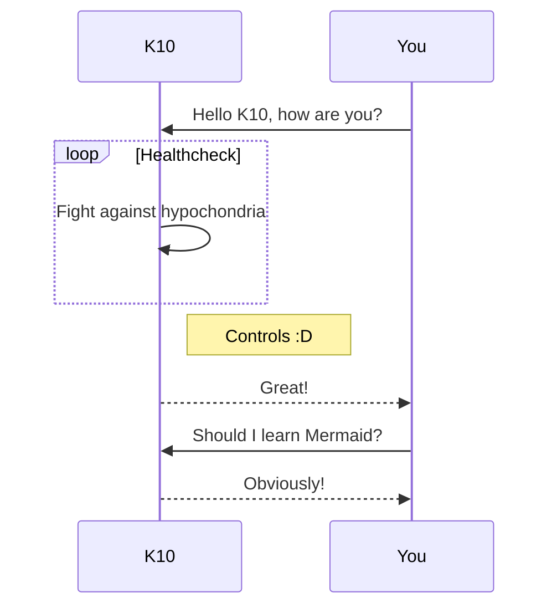

- 👋 Hi, I’m @kmetcalfe-cfs
- 👀 I’m interested in controls
- 🌱 I’m currently learning controls
- 💞️ I’m looking to collaborate on controls
- 📫 How to reach me controls

<!---
kmetcalfe-cfs/kmetcalfe-cfs is a ✨ special ✨ repository because its `README.md` (this file) appears on your GitHub profile.
You can click the Preview link to take a look at your changes.
--->
